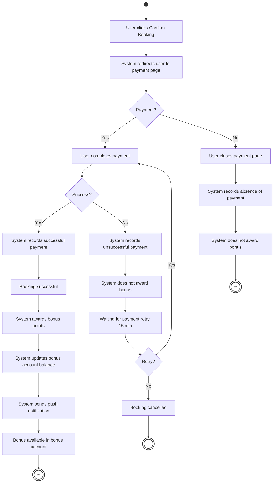

# Feature: Bonus Points for Successful Bookings

## Use Case: Awarding Bonus Points for Successful Bookings

This activity diagram describes the process of awarding bonus points after a successful booking payment. 
It includes the main flow, an unsuccessful payment scenario, 
and a scenario where the user closes the payment page before completing the payment.

